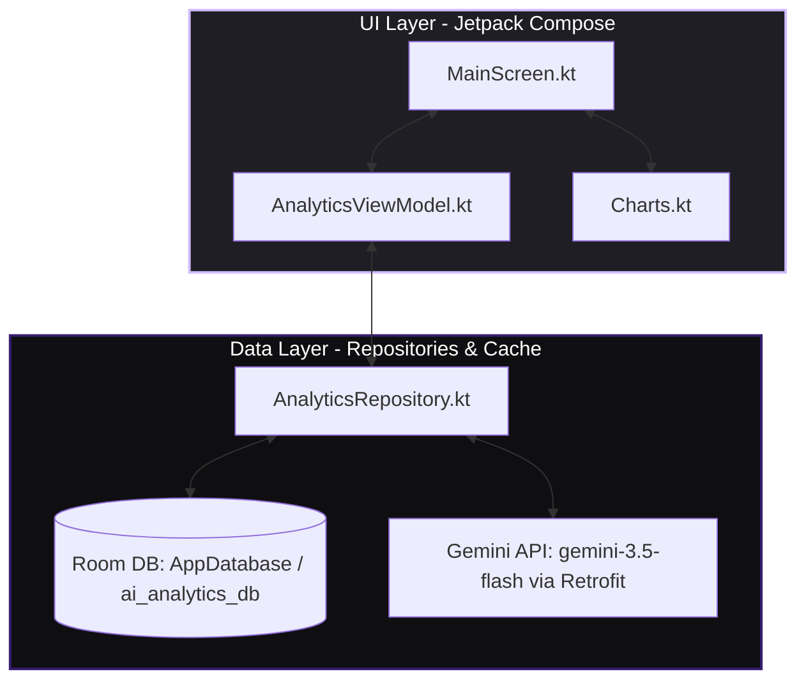

# AI Analytics Dashboard

[](https://kotlinlang.org)
[](https://developer.android.com/jetpack/compose)
[](https://ai.google.dev)
[](/LICENSE)

**แอปวิเคราะห์ข้อมูลอัจฉริยะด้วย AI** ที่ขับเคลื่อนด้วย **Gemini 3.5 Flash** ออกแบบมาเพื่อให้ผู้ใช้สามารถอัปโหลดข้อมูล สั่งงานและถามคำถามด้วย**ภาษาไทยธรรมชาติ** เพื่อสร้างแผนภูมิแบบ Interactive, KPI Indicators และสรุปบทวิเคราะห์เชิงธุรกิจเชิงลึกได้อย่างสะดวกรวดเร็วบนระบบปฏิบัติการ Android

---

## 📋 สารบัญ
- [🧭 ภาพรวมโปรเจกต์](#-ภาพรวมโปรเจกต์)
- [🚧 สถานะของโปรเจกต์ (Project Status)](#-สถานะของโปรเจกต์-project-status)
- [✨ คุณสมบัติหลัก (Key Features)](#-คุณสมบัติหลัก-key-features)
- [📱 ภาพหน้าจอและการทำงาน (Screenshots)](#-ภาพหน้าจอและการทำงาน-screenshots)
- [🏗️ สถาปัตยกรรมและโครงสร้าง (Architecture Diagram)](#%EF%B8%8F-สถาปัตยกรรมและโครงสร้าง-architecture-diagram)
- [🛠️ Tech Stack](#%EF%B8%8F-tech-stack)
- [🚀 การติดตั้งและเริ่มต้นใช้งาน (Installation)](#-การติดตั้งและเริ่มต้นใช้งาน-installation)
- [⚙️ การตั้งค่าคีย์ (Configuration)](#%EF%B8%8F-การตั้งค่าคีย์-configuration)
- [🧪 การทดสอบระบบ (Testing)](#-การทดสอบระบบ-testing)
- [📁 โครงสร้างโฟลเดอร์โปรเจกต์ (Project Structure)](#-โครงสร้างโฟลเดอร์โปรเจกต์-project-structure)
- [⚠️ ข้อจำกัดในปัจจุบัน (Known Limitations)](#%EF%B8%8F-ข้อจำกัดในปัจจุบัน-known-limitations)
- [🔐 ความปลอดภัยระดับการใช้งานจริง (Security & Production)](#-ความปลอดภัยระดับการใช้งานจริง-security--production)
- [🗺️ แผนการพัฒนา (Roadmap)](#%EF%B8%8F-แผนการพัฒนา-roadmap)
- [📄 สัญญาอนุญาต (License)](#-สัญญาอนุญาต-license)

---

## 🧭 ภาพรวมโปรเจกต์

**AI Analytics** คือแอปพลิเคชันต้นแบบ (Prototype Preview) ที่นำความสามารถของ **Generative AI** มาผสานกับแอปพลิเคชันฝั่งมือถือ เพื่อช่วยลดช่องว่างในการทำงานกับข้อมูลขนาดใหญ่:
- **ภาษาไทยเป็นหลัก**: ผู้ใช้สามารถป้อนคำถามภาษาไทย เช่น *"ยอดขายรวมกลุ่มสมาร์ทโฟนดีกว่าแท็บเล็ตอย่างไร"* หรือ *"สรุปแนวโน้มรายสัปดาห์"*
- **วิเคราะห์เชิงสถิติแม่นยำ**: การประมวลผลถูกควบคุมด้วย Gemini 3.5 Flash JSON Mode ที่ลดความเพี้ยนของข้อมูล และบังคับการส่งกลับข้อมูลในโครงสร้างตารางและกราฟที่ถูกต้อง 100%
- **ทำงานออฟไลน์**: บันทึกข้อมูลและประวัติการวิเคราะห์ลงในฐานข้อมูลภายในเครื่อง (Local SQLite via Room DB)

---

## 🚧 สถานะของโปรเจกต์ (Project Status)

> **📝 หมายเหตุโปรเจกต์**: โปรเจกต์นี้อยู่ในสถานะ **Active Development (Prototype / Technical Preview)** 
> - การโหลดและวิเคราะห์ข้อมูลหลักในเวอร์ชันนี้ จะใช้ชุดข้อมูลจำลองประสิทธิภาพสูง (**Dataset Templates**) ครอบคลุมด้านยอดขาย (Sales), ยอดการเข้าใช้งานระบบ (Web Traffic), ข้อมูลการเงิน (Finance) และสินค้าคงคลัง (Inventory)
> - โมดูลการวิเคราะห์และการสร้างคำสั่ง SQL จัดทำขึ้นเพื่อจุดประสงค์ในการสาธิตโครงสร้างความสามารถและเรียนรู้รูปแบบสถาปัตยกรรมเชิงระบบ (Educational & Concept Preview)

---

## ✨ คุณสมบัติหลัก (Key Features)

- **AI Prompting ด้วยภาษาไทย** — รองรับการถามตอบและสั่งงานวิเคราะห์ด้วยภาษาไทยธรรมชาติอย่างเต็มรูปแบบ
- **แผนภูมิแบบ Interactive** — แสดงผลแผนภูมิชนิดต่าง ๆ (Bar Chart, Line Chart, Pie Chart) พร้อมแถบแสดงสถิติแบบยืดหยุ่นปรับสีตามธีม
- **KPI Indicators** — บอร์ดแสดงผลตัวเลขชี้วัดหลัก เช่น ยอดขายรวม, อัตราเติบโต, อัตราความคืบหน้าเชิงสถิติ
- **การบันทึกประวัติ (Room Database)** — เก็บประวัติการป้อนคำถามและผลการวิเคราะห์ของ AI ทั้งหมดเพื่อสืบค้นย้อนหลังได้ทันที
- **เมนูลัดด่วน (Quick Actions)** — แป้นทางลัด เช่น *"สรุปรายเดือน"* และ *"ค้นหาจุดบกพร่อง"* ช่วยสร้างคำสั่งด่วนในคลิกเดียว
- **ธีมมืดสุดพรีเมียม (Elegant Dark Theme)** — ใช้ชุดโทนสี Material 3 ที่เป็นเอกลักษณ์ เฉดสี Obsidian, Deep Slate และสีไฮไลท์แบบ Accent Cyan ให้ความรู้สึกผ่อนคลายและดูเป็นมืออาชีพ

---

## 📱 ภาพหน้าจอและการทำงาน (Screenshots)

*หมายเหตุ: สามารถจัดเก็บภาพหน้าจอการทำงานจริงไว้ที่โฟลเดอร์ `/screenshots` ภายในโปรเจกต์ของคุณ*

| **1. แดชบอร์ดสรุปผลรวม (Elegant Dashboard)** | **2. แผนภูมิวิเคราะห์แนวโน้ม (Interactive Charts)** |
| :---: | :---: |
|  <br> *หน้าจอหลักจำลองการรายงาน KPI และความก้าวหน้า* |  <br> *แผนภูมิแท่งรายสัปดาห์พร้อมเมนูลัดช่วยเหลือ* |

| **3. ประวัติการวิเคราะห์ย้อนหลัง (History Logs)** | **4. การตอบคำถามเชิงลึกจาก AI (AI Thai Prompt)** |
| :---: | :---: |
|  <br> *ประวัติการวิเคราะห์ทั้งหมด บันทึกถาวรออฟไลน์* |  <br> *วิเคราะห์ภาษาไทยอัจฉริยะพร้อมแนะนำชุดคำสั่ง SQL* |

---

## 🏗️ สถาปัตยกรรมและโครงสร้าง (Architecture Diagram)

โปรเจกต์นี้ได้รับการพัฒนาขึ้นโดยอิงตามรูปแบบสถาปัตยกรรม **Clean Architecture / MVVM (Model-View-ViewModel)** ของทาง Android:



---

## 🛠️ Tech Stack

- **UI Framework**: Jetpack Compose 1.7+ & Material Design 3 (M3)
- **AI Core**: Google Gemini 3.5 Flash Model (เรียกผ่าน Retrofit Endpoint ในรูปแบบ JSON Schema บังคับระดับ API)
- **Database (Persistence)**: Room Database (SQLite) + Kotlin Flow สำหรับ Real-time Update
- **Networking**: Retrofit 2 + OkHttp 4 (กำหนด Timeout 60s เพื่อความเสถียร) + Moshi (สำหรับการ Parse JSON ที่ปลอดภัยรวดเร็ว)
- **Asynchronous Flow**: Kotlin Coroutines & StateFlow / SharedFlow
- **Theme Color Style**: Elegant Dark (Obsidian Background, Slate Surfaces, Accent Colors)
- **Testing**: Robolectric (สำหรับการจำลอง Android environment บน JVM) และ Roborazzi (สำหรับการตรวจจับ UI Screenshot และ Visual Regression)

---

## 🚀 การติดตั้งและเริ่มต้นใช้งาน (Installation)

### สิ่งที่จำเป็นต้องมีก่อนติดตั้ง (Prerequisites)
- **Android Studio** (เวอร์ชัน Ladybug หรือใหม่กว่า)
- **JDK 17** หรือเวอร์ชันที่สูงกว่า
- **Gemini API Key** (รับคีย์ของคุณได้ที่ [Google AI Studio](https://aistudio.google.com))

### ขั้นตอนการรันโปรเจกต์
1. ทำการ Clone โปรเจกต์ลงเครื่องคอมพิวเตอร์ของคุณ:
   ```bash
   git clone https://github.com/niphan1000/cyber-data-analyst-compose.git
   cd cyber-data-analyst-compose
   ```
2. คัดลอกไฟล์ต้นแบบ Environment Variable ไปยังไฟล์ทำงานจริง:
   ```bash
   cp .env.example .env
   ```
3. เปิดไฟล์ `.env` ด้วยโปรแกรมแก้ไขข้อความ และทำการเพิ่มคีย์ API ของคุณ:
   ```env
   GEMINI_API_KEY=ใส่_คีย์_API_ที่ได้จาก_AI_Studio_ตรงนี้
   ```
4. เปิดโปรเจกต์ด้วย **Android Studio**
5. รอให้โปรเจกต์ทำการ Sync Gradle จนเสร็จสิ้น
6. กดปุ่ม **Run** เพื่อรันบนอุปกรณ์จำลอง (Emulator) หรืออุปกรณ์จริงของคุณ

---

## ⚙️ การตั้งค่าคีย์ (Configuration)

โปรเจกต์นี้ใช้งานระบบ **Secrets Gradle Plugin** ในการดึงค่าคีย์ความปลอดภัยจากไฟล์ `.env` ไปแสดงผลไว้ในคลาส `BuildConfig` ตอนคอมไพล์ เพื่อป้องกันการฝังคีย์ไว้ในซอร์สโค้ดโดยตรง:

- **`.env` (ไฟล์ส่วนตัว - ห้าม Push ขึ้น Git)**: ใช้สำหรับเก็บ `GEMINI_API_KEY`
- **`.env.example` (ไฟล์สาธารณะ)**: มีไว้เพื่อแสดงตัวอย่างคีย์และโครงสร้างที่ถูกต้อง
- **`BuildConfig`**: ในซอร์สโค้ด Kotlin จะเข้าถึงคีย์ได้ง่ายและปลอดภัยผ่านทาง:
  ```kotlin
  val apiKey = BuildConfig.GEMINI_API_KEY
  ```

---

## 🧪 การทดสอบระบบ (Testing)

คุณสามารถมั่นใจได้ในคุณภาพของโค้ดและการออกแบบผ่านระบบการทดสอบที่รวดเร็วโดยไม่ต้องใช้ Emulator:

### 1. การรัน Unit Tests และ Robolectric Local JVM Tests
ทดสอบ Logic การทำงาน, การสืบค้นฐานข้อมูล Room และฟังก์ชันวิเคราะห์ระบบของ Repository:
```bash
gradle :app:testDebugUnitTest
```

### 2. การตรวจสอบหน้าจอด้วย Screenshot Verification (Roborazzi)
ตรวจสอบว่ามีการแก้ไขที่ส่งผลกระทบต่อดีไซน์เดิม (Visual Regression) หรือไม่:
```bash
gradle :app:verifyRoborazziDebug
```

---

## 📁 โครงสร้างโฟลเดอร์โปรเจกต์ (Project Structure)

```text
app/src/main/java/com/example/
├── MainActivity.kt          # จุดเริ่มต้นและกำหนดค่า Edge-to-edge
├── data/
│   ├── api/                 # Retrofit Interfaces, Data Classes สำหรับส่งคำขอไปยัง Gemini
│   ├── db/                  # Room Entities (เก็บข้อมูล และ History) และ AnalyticsDao
│   ├── model/               # โมเดลข้อมูลสำหรับการสื่อสาร และ Dataset Templates (Sales, Traffic, etc.)
│   └── repository/          # คลาส AnalyticsRepository เชื่อมโยง API กับฐานข้อมูล
└── ui/
    ├── components/          # Charts.kt (แผนภูมิและกราฟดีไซน์คัสตอม)
    ├── screens/             # MainScreen.kt (หน้าแดชบอร์ดหลัก, UI, เมนูลัด, Chat box)
    ├── theme/               # Color.kt, Theme.kt, Type.kt (สไตล์สีและดีไซน์ Elegant Dark)
    └── viewmodel/           # AnalyticsViewModel.kt (บริหารจัดการสถานะ, UI States, รันการวิเคราะห์)
```

---

## ⚠️ ข้อจำกัดในปัจจุบัน (Known Limitations)

- **ฐานข้อมูลจำลอง (Dataset Simulation)**: ฟังก์ชันอัปโหลดไฟล์จริงในเวอร์ชันนี้เป็นการทดสอบความปลอดภัยและการเลือกแม่แบบตาราง (ยังไม่ใช่ตัวดึงไฟล์ดิบเข้า SQLite แบบ Dynamic ทั้งหมด)
- **การประมวลผลขึ้นอยู่กับการเชื่อมต่ออินเทอร์เน็ต**: ในการเรียกคุยกับ Gemini API เพื่อขอข้อมูลสรุปเชิงลึก จำเป็นต้องใช้งานอินเทอร์เน็ตตลอดเวลา
- **ความไม่แน่นอนของคำตอบ (Non-deterministic AI)**: ในบางกรณีคำตอบภาษาไทยหรือการเขียน SQL จำลองจาก AI อาจมีความเบี่ยงเบนเล็กน้อย ควรตรวจสอบความถูกต้องก่อนนำไปอ้างอิงเชิงลึก

---

## 🔐 ความปลอดภัยระดับการใช้งานจริง (Security & Production)

> **⚠️ ข้อควรระวังด้านความปลอดภัย**: ในเวอร์ชันการพัฒนานี้ คีย์ API จะถูกอ่านและรวมไปกับ Build เพื่อสะดวกต่อการพัฒนาออฟไลน์และการรันเทสบน Sandbox หากนำไปเปิดให้ใช้งานจริง (Production) ควรระมัดระวังเป็นพิเศษ

**แนวทางปฏิบัติเพื่อความปลอดภัยระดับอุตสาหกรรม**:
1. **การใช้งาน Backend Proxy**: ส่งคำร้องขอวิเคราะห์ไปที่ Cloud Server ของคุณก่อน (เช่น Node.js / Python server หรือ Cloud Functions) แล้วปล่อยให้ Server คุยกับ Gemini API เพื่อปกป้องคีย์ไม่ให้รั่วไหลไปกับไฟล์ APK ของแอป
2. **เปิดใช้งาน Firebase App Check**: เพื่อตรวจสอบความถูกต้องของอุปกรณ์ที่ส่งคำขอเข้ามา
3. **การควบคุมปริมาณคำขอ (Rate Limiting)**: ป้องกันสแปมคำสั่งวิเคราะห์ข้อมูลเพื่อควบคุมต้นทุน API

---

## 🗺️ แผนการพัฒนา (Roadmap)

- [x] ออกแบบโครงสร้างสถาปัตยกรรม MVVM และเชื่อมโยงฐานข้อมูล Room Cache
- [x] ปรับเปลี่ยนระบบ Config บังคับ JSON Output จาก Gemini API (gemini-3.5-flash) ในระดับ Schema ป้องกันการส่งข้อมูลผิดรูปแบบ
- [x] ออกแบบธีมพรีเมียมมืด (Elegant Dark Theme) และจัดทำไอคอนที่สอดคล้องกัน
- [x] จัดทำประวัติรายการประมวลผลย้อนหลัง (History Feature) แบบออฟไลน์
- [x] ตรวจสอบและแก้ไขบั๊ก auto-reseed ข้อมูลเมื่อผู้ใช้ตั้งใจลบตารางทั้งหมดทิ้ง
- [ ] พัฒนาฟังก์ชันการนำเข้าไฟล์ CSV และ XLS/XLSX จากโฟลเดอร์เครื่องโดยตรง
- [ ] เพิ่มความสามารถในการส่งออกแผนภูมิเป็นเอกสารไฟล์ PDF หรือรูปภาพ PNG
- [ ] จัดตั้งระบบ Backend Integration ในระดับ Production

---

## 📄 สัญญาอนุญาต (License)

โปรเจกต์นี้เผยแพร่ภายใต้สัญญาอนุญาต **MIT License** ดูรายละเอียดเพิ่มเติมที่ไฟล์ [LICENSE](/LICENSE)

---

**พัฒนาขึ้นและบำรุงรักษาโดย ทีมพัฒนา AI Analytics**  
หากมีข้อสงสัยหรือมีข้อเสนอแนะเพิ่มเติม สามารถรายงานปัญหาได้ที่: [GitHub Issues](https://github.com/niphan1000/cyber-data-analyst-compose/issues)
